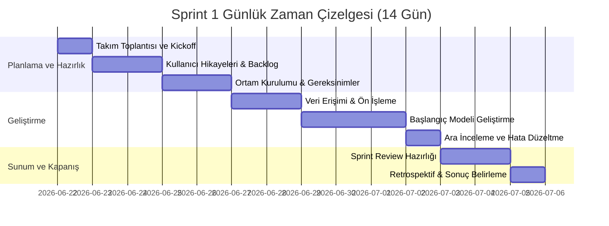
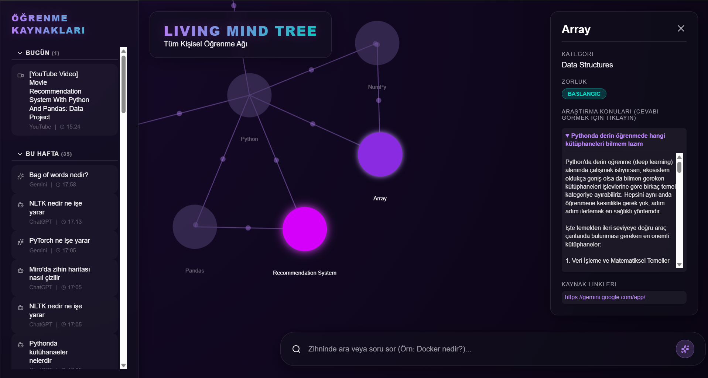
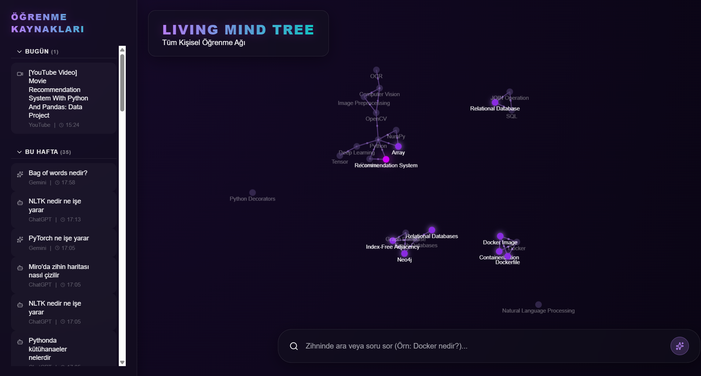

# **Takım - LearnSphere AI**

### **`LearnSphere AI`**

> **Otonom Öğrenme Hafızası ve Zihin Haritası Asistanı**

---

## **Takım Üyeleri**

| | İsim | Rol | GitHub | LinkedIn |
| :---: | :--- | :--- | :---: | :---: |
|  | **Ömer Semih Uzun** | Product Owner - Developer | [@omersemihuzun](https://github.com/omersemihuzun) | [in/omer-semih-uzun](https://www.linkedin.com/in/omer-semih-uzun/) |
|  | **Bahar Karakaş** | Scrum Master - Developer | [@baharkarakas](https://github.com/baharkarakas) | [in/bahar-karakaş](https://www.linkedin.com/in/bahar-karakaş) |
|  | **Gülistan Ergün** | Developer | [@gulistanergun](https://github.com/gulistanergun) | [in/gulistanergun](https://www.linkedin.com/in/gulistanergun/) |
|  | **Mevlüt Uçar** | Developer | [@mevlutucar](https://github.com/mevlutucar) | [in/mevlutucar](https://www.linkedin.com/in/mevlutucar) |
|  | **Sude Tuğlu** | Developer | [@tuglusude](https://github.com/tuglusude) | [in/sudetuğlu](https://www.linkedin.com/in/sudetu%C4%9Flu) |

> Roller bootcamp boyunca sabittir; PO ve SM dahil herkes kod yazar. Ekip içi iletişim kuralı: birincil SM Bahar Karakaş, yedek PO Ömer Semih Uzun.

---

## **Ürün Açıklaması**

**LearnSphere AI**, kullanıcının web tarayıcısındaki öğrenme aktivitelerini otonom olarak izleyip, içinden teknik kavramları çıkaran ve bunları interaktif bir **Bilgi Grafiği (Knowledge Graph)** olarak görselleştiren yapay zeka destekli bir "İkinci Beyin" uygulamasıdır. 

Özellikle yazılımcılar, öğrenciler ve kendi kendine öğrenen bireyler için geliştirilen bu sistem; YouTube, Gemini ve ChatGPT gibi platformlardaki araştırma süreçlerini arka planda sessizce dinler. Öğrenilen konuları ve aralarındaki ilişkileri tespit ederek dinamik bir zihin haritası oluşturur. Böylece kullanıcılar not alma zahmetine girmeden kendi öğrendikleri bağlamlar üzerinden, yapay zekaya diledikleri zaman soru sorarak (RAG Chat) bilgilerini tazeleyebilirler.

<details>
<summary><strong>Ürün Özellikleri</strong></summary>
  
---

### 1. Otonom Veri Toplama
- Chrome Extension vasıtasıyla YouTube, Gemini ve ChatGPT sekmelerinde kullanıcının izlediği eğitimsel içerikleri ve sorduğu soruları otomatik olarak yakalar.

### 2. AI Destekli Kavram Çıkarımı
- Elde edilen veriler gelişmiş dil modelleriyle analiz edilerek konu, kategori ve zorluk dereceleri çıkarılır. Eğitimsel olmayan veriler elenir.

### 3. Bilgi Grafiği (Knowledge Graph) & Zihin Haritası
- Öğrenilen kavramlar arasındaki ilişkiler ağ yapısında (Graph DB) saklanır ve fizik kurallarıyla çalışan interaktif **Living Mind Tree** arayüzünde görselleştirilir.

### 4. İkinci Beyin (RAG Sohbet)
- Vektör veritabanında saklanan kişisel bilgiler üzerinden semantik arama yapılarak, kullanıcının doğrudan kendi veritabanındaki bilgilerle sohbet etmesine olanak tanınır.

### 5. Kaynak Yönetimi
- Kullanıcılar kendi bilgi ağındaki istenmeyen kaynakları kontrol paneli üzerinden silebilir ve süzebilir.

---
</details>

<details>
<summary><strong>Hedef Kitle</strong></summary>

---

### Kendi Kendine Öğrenenler (Self-learners)
- Farklı kaynaklardan (video, makale, yapay zeka) edindikleri bilgileri tek bir yerde birleştirmek ve takip etmek isteyenler.

### Yazılım Geliştiriciler ve Mühendisler
- Yeni teknolojileri, dilleri veya kütüphaneleri öğrenirken kavramları birbiriyle ilişkilendirip daha büyük bir yapı görmek isteyen profesyoneller.

### Öğrenciler ve Akademisyenler
- Araştırma süreçlerini otomatikleştirip, not almak yerine verilerini görsel bir ağ (mind map) üzerinde görüp daha kalıcı bir öğrenme hedefleyenler.

### Kişisel Verimlilik (Productivity) Odaklılar
- Klasik not tutma uygulamalarının manuel yükünden kurtulup, sürecin otonom çalışmasını isteyen yenilikçi kullanıcılar.

---
</details>

## **Product Backlog URL**

[Miro Backlog Board](https://miro.com/app/board/uXjVHCRzr6Q=/?share_link_id=571188315568)

---

## **Sprints**

<details>
<summary><strong>Sprint 1: Temel Mimari ve Otonom Öğrenme Ağının İnşası</strong></summary>

---

### 1. Kullanıcı Hikayeleri (User Stories) & Kabul Kriterleri
1. **Veri Toplama:** Kullanıcı araştırma yaparken arka planda eklenti sessizce kavramları toplamalıdır.
   - *Kabul Kriteri:* Sadece eğitimsel olanlar seçilmeli, gündelik veriler elenmelidir.
2. **Zihin Haritası:** Kullanıcı son öğrendiği kavramları bir ağ grafiği üzerinde dinamik olarak görmelidir.
   - *Kabul Kriteri:* Kavramlar zorluk seviyesine göre farklı boyutlarda ve ilişki bağlarıyla görünmelidir.
3. **Unutma Eğrisi Tahmini (Data Science):** Sistem, bir bilginin ne zaman unutulacağını ML ile tahmin edebilmelidir.
   - *Kabul Kriteri:* Model, sentetik verilerle eğitilmeli ve risk altındaki kavramları tespit etmelidir.

### 2. Sprint Planı ve Backlog
- **Puanlama:** İşler görevlere (task) ayrıldı ve efor dizisiyle puanlandı.
- **Odak (Focus):** Altyapı (FastAPI + Neo4j) ve Veri Bilimi temel modeli.


### 3. Sprint 1 Zaman Çizelgesi (Gantt Chart)
Aşağıdaki çizelge, 14 günlük Sprint 1 sürecimizin günlük takvimini göstermektedir:



### 4. Daily Scrum Notları
Takım içi iletişim ve günlük planlamalar (Daily Scrum) WhatsApp üzerinden yapılmıştır. Günlük iş dağılımlarımızdan örnek bir kesit aşağıdadır:


### 5. Ortam Kurulumu & Tekrar Üretilebilirlik
Proje şu şekilde çalıştırılmalıdır:
```bash
cd backend
docker-compose up -d
pip install -r requirements.txt
python -m uvicorn app.main:app --reload --port 8080
```

### 5. Veri Erişimi ve Baseline Model (Yapay Zeka)
- Sprint 1'de **HLR (Half-Life Regression)** Unutma Eğrisi modeli üzerine çalışıldı.
- `data-science` klasöründe sentetik test verisi (`learning_logs.csv`) üretilerek kavram zorluğuna göre bir *Forgetting Curve* modeli (baseline) oluşturuldu. Arama/Filtreleme özellikleri entegre edildi.

### 6. Definition of Done (DoD)
- Kod test edildi ve hata fırlatmadan ayağa kalktı.
- FastAPI backend ve React frontend entegre bir şekilde birbirine bağlandı.

### 7. Uygulama Ekran Görüntüleri
> *Şu an projemizden alınan en güncel arayüz görüntüleri aşağıdadır:*




---
</details>

<details>
<summary><strong>Sprint 2: Privacy-First Local AI Mimarisine Geçiş</strong></summary>

---

### Sprint 2 Hedefleri
Jürinin en çok dikkat edeceği "gizlilik" ve "bağımsızlık" kuralları gereği, projemiz dışa bağımlı Google/OpenAI servislerinden tamamen arındırılacaktır.

1. **Yerel Embedding Modelleri:** Vektör oluşturma işlemleri için dışarıya (Google API) istek atmak yerine, `langchain-huggingface` üzerinden `sentence-transformers/all-MiniLM-L6-v2` yerel modeli kullanılacaktır. Böylece kullanıcı verileri internete sızmayacaktır.
2. **Koleksiyon Güncellemesi:** Yerel modellere geçişle birlikte Qdrant vektör veritabanımız 384 boyutlu vektörleri destekleyecek şekilde yeniden optimize edilecektir.
3. **Ekip Dağılımı:** Ön yüz ve arka yüz bileşenlerindeki son rütuşlar Bahar, Mevlüt ve Sude tarafından koordine edilecektir.

---
</details>
